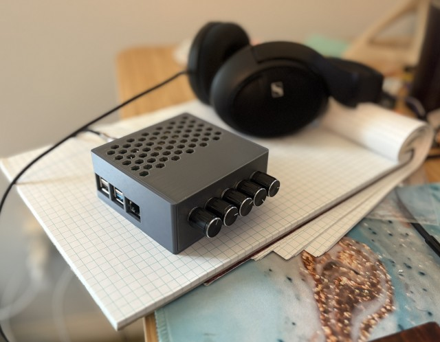
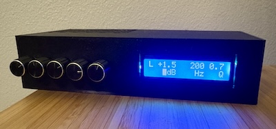

# camdac
DSP / DAC and headphone amplifier based on a Raspberry Pi and CamillaDSP


**Status**: This is in the "tinkerer" phase. Things are up and running just fine (see the notes.md for the current punch-list). But, expect to do things like ssh onto the device to start up the knob control script (`camdac.py`) and use a browser to the onboard Camilla GUI server to re-define your filters. You don't need the Pi physically hooked to anything but USB power if you want to stream to it. But, you can customize the knobs to do whatever aspects of EQ you like. Heck, you can skip the onboard DAC HAT and just use "Gadget mode" to process from USB to USB.

**August 2025**: Big update here is the addition of a display, a new case to go along with it, and allowing the filter knobs to switch what aspect you're controling (gain, freq, Q, and type)


## What is it?  Why is it?
I like knobs. I like EQ. When I started in audio, we EQ'ed with knobs. I yearn for that simpler time. So, I made this overly-complex solution to that problem ;)

OK, a better answer.  CamDAC is a project that lets you construct a device to give your audio system stand-alone, fully-customizable DSP processing for things like parametric EQ. It's based off of a Raspberry Pi running [CamillaDSP](https://github.com/HEnquist/camilladsp), a very efficient DSP processing utility. While it runs in software on Linux, macOS, and Windows (meaning you could just run it in software), CamDAC gives you a physical device with physical adjusters. A few use-modes:
- Given that this is a Raspbery Pi, it can house our mount network-based music shares and you can have it directly stream from there with parametric EQ pushing audio out the RCA jacks or the headphone jack
- Given that, you can run Shairplay and stream from your iPhone, iPad, etc. or any other Airplay device and have lossless streaming with parametric EQ
- You can have USB input and USB output, turning this into an inline digital parametric EQ device.  See *Gadget Mode* below.
- Configure this to your heart's content. Got an EQ profile you overall like for your headphones or speakers, but feel, at times, you want a touch more bass or some more "air"?  Have a mood or an album where you just want nothing to do with upper-bass? Assign these filters to the knobs and have this overlay on top of your existing EQ profile.
- No seriously -- to your heart's content.  Want a knob that simultaneously adds a low-shelf and a high-shelf filter at once (make me a V!)? Want one that adjusts the Q of a filter rather than it's amplitude? Heck, want to turn a knob that both adjusts that V shaped response while also adjusting the Q of the slopes and varies the amplitude of a notch centered on 3.14 kHz? Go for it.  You're strange, sure, but go for it.
- *Remember, you can have more filters than knobs*. For example, I've got mine setup right now with 6 filters for my headphones as the basic starting point. In addition to those, I've got 4 more filter knobs giving me several different shelf or peaking filters to play around with. So, I start off with my current go-to EQ setup for these headphones, but have other adjustments I can add in (in addition to giving volume and balance knobs).


## What do I need?
You'll need the following to construct the device:
- A Raspberry Pi 4.  You can likely use others, but it's setup now for the 4B
- (semi-optional): A DAC HAT. This plugs onto the RPi board and gives you RCA and headphone outputs. It's configured now for the [Raspberry Pi DAC+](https://www.raspberrypi.com/products/dac-plus/) (formerly the IQAudio DAC+). If you use this as a USB gadget only (PEQ on USB in to USB out), you don't need this.
- A micro USB card for the RPi.  I got a 64G one for $5 and I've used under 10G on it.
- USB power for the Pi. I'm using some USB-C Apple wall supply I had around. Max it'll need ever is 3A @ 5V, but I've run it happily on a 1.5A 3V supply.
- A case: I've provided STL and SCAD files for what I've made
- Rotary encoders: Just the basic ones (not the modules) are all you need
- A way to wire the encoders to the GPIO pins. I used a simple off-the-shelf GPIO breadboard that made it easy.  More details are in the `GPIO_lines.md` file. But, you'll need a basic soldering setup
- A lack of paralyzing fear when looking at code. I've written a bunch here and more instructions may come, but the whole point here is to be able to customize this and that does mean being able to change things in a text file

All-in, I'm under $100 USD

# OK, where do I start?
## Get your RPi going and CamillaDSP on it
Assuming you've got your parts, you'll need to install the RPi OS, Camilla DSP, and, optionally Shairpoint. Fortunately, someone's written all that up for us and done a great job.  All hail _mdsimon2_!.  Seriously, just go follow [mdsimon2's instructions](https://github.com/mdsimon2/RPi-CamillaDSP). It'll start off having you do things like this once the OS is installed:

```
mkdir ~/camilladsp ~/camilladsp/coeffs ~/camilladsp/configs
wget https://github.com/HEnquist/camilladsp/releases/download/v3.0.1/camilladsp-linux-aarch64.tar.gz -O ~/camilladsp/camilladsp-linux-aarch64.tar.gz
sudo tar -xvf ~/camilladsp/camilladsp-linux-aarch64.tar.gz -C /usr/local/bin/

sudo wget https://raw.githubusercontent.com/mdsimon2/RPi-CamillaDSP/main/camilladsp.service -O /lib/systemd/system/camilladsp.service

... (keep going )

```
I did Steps 1-7 but have skipped the Step 8 (gadget mode) for now as I've not got the required hardware yet. Two big things:
1) **For Sep 7, Enable ALSA Loopback**, you are running in ALSA mode. So, setup that loopback
2) **When it comes to Step 9, Assign the Active Configuration**, use the `CamDAC_config.yml` file here. It's got all you need to get going (see below) 

Note, if you've followed the dfault paths here, on your host machine, you should be able to connect to the CamillaDSP GUI using a web browser on port 5005. This can be super, super handy as you can monitor just what's going on with Camilla.

While we're here, we have one more thing to do. That guide assumes you're using the headphone jack on the Pi board itself. We're using the much nicer [TI 5122](https://www.ti.com/document-viewer/pcm5122/datasheet) one. To do this, we need to turn off the onboard sound by commenting out the audio with `#dtparam=audio=on` in `/boot/firmware/config.txt`. If you get lost here, check the [RPi DAC docs](https://www.raspberrypi.com/documentation/accessories/audio.html) 

While here, you may want to install Shairport. This lets you Airplay (lossless WiFi) to your box.  That's included in [mdsimon2's Streamer Applications](https://github.com/mdsimon2/RPi-CamillaDSP?tab=readme-ov-file#streamer-applications) section of the instructions.

FWIW, setting up a Remote Desktop (VNC is baked in) is optional. I found it handy when trying to debug my audio devices a bit as it gave an easy way of changing the default, but it really is just optional. For all the development work, I'm just using VSCode and an ssh remote onto the device. Currently, if you do the VNC route, actually use TigerVNC. Remmina and some others have issues.

Once everything is set and you've done a reboot, test it out.  A quick test for Camilla's basic operation and the DAC HAT's operation, try this on the command line: `speaker-test -D hw:Loopback,1 -c 2 -r 44100 -F S32_LE`.  You're telling Linux to send pink noise to the ALSA Loopback device. The `CamDAC_config.yml` that should be running in your Camilla DSP interface is listening on the hw:Loopback and sending to the DAC HAT. In their lingo, the capture device is `hw:0` and the DAC HAT is `hw:CARD=DAC,DEV=0`. A [screencap](images/camilla_config.png) sample running configuration in the Camilla DAC GUI is provided here in the images folder. If things are working, don't worry yet about the other parameters. You're doing your're processing at 88.1k and you're setup to adjust the sample rate as needed. There's plenty of time to geek out on this later after going over the main [Camilla DSP docs](https://github.com/HEnquist/camilladsp)


## Install pyCamillaDSP
The code here uses [pyCamillaDSP](https://henquist.github.io/pycamilladsp/config/) as a Python front-end to Camilla's web-sockets so we can control Camilla. If that means nothing to you, forget I typed it. We need a Python library to be installed so that our code can work. Unlike a simple pip-based install, this *really* wants to be in a virtual environment and not be installed into the main system python. Here's how you do that and install the library (make sure though to include the system packages or you'll miss out on all the RPi bits we need).
```
python -m venv  --system-site-packages ~/camilladsp/.venv
source ~/camilladsp/.venv/bin/activate
pip install git+https://github.com/HEnquist/pycamilladsp.git
```

With that done, as you work with the code, you'll need to either first activate the environment (that `source ~/camilladsp/.venv/bin/activate` bit) or just tell Linux to use that environment's python and run the code with `~/camilladsp/.venv/bin/python some_script.py`. So, to run the CamDAC now, before we have any service running, you can just `~/camilladsp/.venv/bin/python camdac.py`

## Wire up your encoders
I've covered my configuration of the GPIO lines and how I wired things up in the [GPIO_lines.md](GPIO_lines.md) file. Head over there for the details.

## Case
The case came from [Pieterbos82](https://www.thingiverse.com/thing:4753525) on Thingiverse originally.  I took his SCAD code, fumbled my way through SCAD, and revised it.  Notably, I turned off the Neutrik / XLR bits, reworked the DAC HAT spacing for the IQAudio / RaspberyPi branded DAC boards, and added holes in the "front" for our controls. The STL and SCAD files are all included here for printing or modification.

## Test out your hardware
Once built, you'll want to make sure the encoders are working correctly.  The supplied `encoder_tester.py` will do this for you. Run it with `~/camilladsp/.venv/bin/python ~/camdac/encoder_tester.py`.  You should be able to adjust all your knobs and have the code report your chages. Press each button and check it too. Hold down the first knob to exit (or Ctrl-C)

# Customizing your rig
Still here?  Now, for the fun.  It's time to make those knobs do what you want.  There are two places to work in and consider here: the `camdac.py` file that actually talks to CamillaDSP and the `CamDAC_config.yml` file.

## The CamDAC_config.yml file
This is the configuration file for CamillaDSP tied to the project. After installing Camilla DSP, copy it into the `~camilladsp/configs/` folder if it's not already there from above.  Assuming you've got the [CamillaDSP GUI](http://raspberrypi.local:5005/gui) running (you did install that above right?), go to the Files tab, load this up and set it to be "active" (starred)

You can customize this in a text editor or in the CamillaDSP GUI. There are a few key bits here:
- We have filters named "Filt1", "Filt2", ... "Filt5".  These are ones, by default, configured to be accessible by `camdac.py` and be adjusted with the knobs. You can use different names if you like, but just know that `camdac.py` needs to send configuration updates for the active config that match these names.  Best to set their default gain, initially at least, to zero. But, **here is where you actually set things like the frequency and Q**.  The `camdac.py`, by default, just changes the amplitude of these filters.
- There's an example "LShelf" filter. You'll have some filters you want always in the pipeline.  Think of these as your "base configuration" if you like and the FiltN as what rides on top of these. Setup whatever you like here in the Filters section and add it to the Pipeline as well.
- We have separate volume filters for L and R to give our balance. They work by using the Aux sliders to reduce gain in one or the other channel

## The camdac.py file
At some point, this will be tied to a system service, but for now, it's just a file to run manually. But, it does all our heavy-lifting.  At the outset, we have some simple constants saying how much we want each click of the encoder to adjust the volume or an EQ filter:
```
volume_step = 0.25
balance_step = 0.05
eq_step = 0.5
```
After that, you'll start seeing some notes to you saying where you're more or less likely to find things to customize. The first one to look at is to check the `encpins` and adjust if you put your knobs on different GPIO lines. Next, you'll see declarations of our kobs.

That section lays out some defaults to pay attention to. Most notably, the `name` attribute says what each knob starts off acting like. You can adjust things here if you like, but further down, we get to the "Setup what the knobs and buttons actually do" where you can override things.

The key to note here is that how the knob behaves is goverend by the `name` attribute. `Volume` makes it control the main volume.  `VolBal` has it toggle (based on press) between Volume and Balance. Anything else is the name of a filter it'll try to control the amplitude of.  We trap both clockwise and counter-clockwise events so we can know the direction and we turn what `gpiozero` normally has as just simple functions into lambda ones so that we cana include optional parameters with info about not just the `gpiozero` encoder that made the event, but that direction and our higher-level Encoder class that it's tied to.  I'm passing all this in to give us the most flexibility in what we want the knobs to be able to do.

# Misc bits
A few utilities to help here:
- `encoder_tester.py`: Lets you watch your encoder events to make sure all is working
- `fetch_config.py`: Dumps the running configuration to files and shows you an EQAPO style filter configuration

# Gadget mode
You don't need to use any onboard DAC. You can just as well use the device as an in-line digitial PEQ device. 

- Figure your current DAC's capable modes. If it's plugged into a Linux box `aplay -l` to list the devices. In my case, the Fulla was on card1.  Then, see what modes are supported `cat /proc/asound/card1/stream0`.  So, all typical suspects from 44100 - 384000, 16_LE, 24_3LE, and 32_LE

- Set the RPi up to run in gadget mode and offer up an audio interface. Instructions are ocming from [mdsimon2](https://github.com/mdsimon2/RPi-Camilla). It's also good to have [DeLub's post on ASR](https://www.audiosciencereview.com/forum/index.php?threads/using-a-raspberry-pi-as-equaliser-in-between-an-usb-source-ipad-and-usb-dac.25414/page-3#post-1180356) on hand (we're well past the need to compile anything in that thread though). For now, I'm just going to offer up 44100 like mdsimon2 did 
```
echo 'dtoverlay=dwc2' | sudo tee -a /boot/firmware/config.txt > /dev/null
echo -e 'dwc2\ng_audio' | sudo tee -a /etc/modules > /dev/null
echo 'options g_audio c_srate=44100 c_ssize=4 c_chmask=3 p_chmask=0' | sudo tee -a /etc/modprobe.d/usb_g_audio.conf > /dev/null 

sudo reboot now
```
- Use the USB-C power/data splitter. Power supply goes into power (duh), USB2 data goes to your computer, USB/data goes to Rpi.  On the RPi then, have a USB2 port go to your DAC.  You should get your USB chime.  If you're on a Linux host, you should see a "Linux USB Audio Gadget" with `aplay -l` or `lsusb`. You should see the audio format available as well with `cat /proc/asound/card1/stream0` (change card1 to yoru card number from aplay or lsusb) 
- On the RPi, we need to setup CamillaDSP to now be able to listen to this input, do its DSP, and then send out.
  - Run `aplay -L` and look for your DAC. It'll give a big list of possible devices. I've been having Camilla output to `hw:CARD=DAC` to send audio to my RPi DAC.  Look for an "hw" one that shows your device.  Mine is `hw:CARD=Schiit`. It may help to run `aplay -L | grep hw` to filt out and just get the "hw" ones.
  - In that `aplay -L` you should see `usbstream:CARD=UAC2Gadget` (or possibly hw:UAC2Gadget`)
  - In the CamillaDSP GUI, head to Files, enter in "gadget" or some such name at the bottom of the Configs panel, hit Save and star it to mark as active.  
  - In its Devices, set: samplerate=44100 (if you're resampling, you should be able to keep that at your 88200 or whatever you like too), capture device / device = "hw:CARD=UAC2Gadget" (even if it showed as _usbstream_), and Playback device / device = "hw:NAME".  In my case, it was `hw:Schiit` (you can also use `hw:CARD=Schiit`)

FWIW, another great project by [Wang-Yue](https://github.com/Wang-Yue/CamillaDSP-Gadget) is targeted at just this kind of mode of operation, but without hardware knobs.  And we all know, I like knobs.

# Displays
There are a few ways to add a display. If you want something full-featured, we've always got the HDMI outputs. But, we can make a simple display out of an LCD or LED module using the I2C protocol. A great thing about this is that the same pair of data lines that the DAC module uses for basic communication can be used here as the protocol supports multiple devices, so long as they've got different IDs. I used `RPi_I2C_driver.py` from [DenisFromHR](https://gist.github.com/DenisFromHR/cc863375a6e19dce359d) here for the 1602, but there are loads of options.

## Display options
I've tried out both a generic 1602 (16x2 LCD; seems to be a [Z-0234](https://wiki.52pi.com/index.php?title=Z-0234)) modules and a generic 128x32 OLED (based on an SSD1306 chip). Honestly, the 128x32 OLED seems more a pain than it's worth. The one I got is tiny and you really need to treat it like an image device. The `adafruit-circuitpython-ssd1306` library seems nice enough and if you want something fancy like showing the EQ curve, this would be the right approach.  The 1602 works for what I want.

### LCD 1602 voltage
The 1602 setup is designed to run off of 5V and you'll see lots of concerns out there about this and the fact that the Pi operates at 3.3V. Doom, gloom, fear of letting the smoke out of your Pi's chips, etc. abound. There's a [great writeup](https://forums.raspberrypi.com/viewtopic.php?t=313458) about this that even specifically covers the 8574T I2C multiplexer we've got on these boards. The TL;DR is that things are safe, but long cable runs / bad environments could be an issue performance-wise. If so, use a logic level converter (these are super cheap -- like under a dollar for a 4-line converter). But here, the 1602s with those 8574T have the pull-up resistors on the Pi side, so the SDA and SCL lines run at the Pi's 3.3V, not the 5V of the display board (I verified this with an oscilloscope). So, if your display is working properly with the 5V in and data lines run at 3.3V, you're fine. If it starts getting garbled data, put in the logic level converter. Or, be paranoid and run the display at 3.3V turning the contrast all the way down to let you see anything (how I started off). 

BTW, if you're wondring, the little jumper on that 1602 board is to enable / disable the backlight entirely.  

## Finding your display's ID
Odds are you can skip this by either running with the default address or just checking the docs on your module to see what it uses. But, seeing as how the docs on these are pretty ... lean, you can ask your Pi what the module has registered itself as. Hook up the display (SDA, and SCL lines will be shared with the DAC; 5V or 3.3V and GND are the only others needed), power up the Pi and run `sudo i2cdetect -y 1`.  You'll likely see a "UU" in the resulting matrix that you can read out as being in location 4c. That just means we've got a driver loaded for a device at that address.  That's the I2C address of the DAC.  See a hex code somewhere else? That's the address of your display.  My 1602 comes up on 0x27 and the 128x32 OLED comes up on 0x3c. If you're not on 0x27, edit the `RPi_I2C_driver.py` file.
